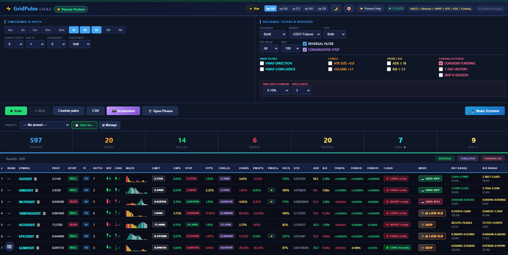

# ⚡ GridPulse v14.7.6

> **Free, open-source, multi-exchange crypto reversal screener** with directional **STRONG / GRID BUY/SELL** modes, **TF-adaptive Strictness**, MACD + VWAP + ATR + ADX + Funding-aware setups across **Bybit, Binance, KuCoin, OKX, and Pionex** — and one-click **Launch Cards** with copy-paste-ready parameters for **Pionex Grid Bots**.

[](https://creativecommons.org/licenses/by-nc-sa/4.0/)
[](https://github.com/pro100off/gridpulse/releases/latest)
[](https://github.com/pro100off/gridpulse/stargazers)
[](index.html)
[]()
[]()

---

## 🔗 Quick links

| Resource | URL |
|----------|-----|
| 🌐 **Live demo (canonical)** | [https://tradescout.trade/](https://tradescout.trade/) |
| 🪞 **GitHub Pages mirror** | [https://pro100off.github.io/gridpulse/](https://pro100off.github.io/gridpulse/) |
| 💻 **GitHub repository** | [https://github.com/pro100off/gridpulse](https://github.com/pro100off/gridpulse) |
| 📢 **Telegram channel** | [https://t.me/tradescoutfree](https://t.me/tradescoutfree) |
| 🐦 **Twitter / X** | [https://x.com/tradeaiscout](https://x.com/tradeaiscout) |
| 📜 **License** | [CC BY-NC-SA 4.0](https://creativecommons.org/licenses/by-nc-sa/4.0/) |
| 📋 **Changelog** | [CHANGELOG.md](CHANGELOG.md) |
| 🐛 **Issues** | [GitHub Issues](https://github.com/pro100off/gridpulse/issues) |
| 🚀 **Latest release** | [Releases](https://github.com/pro100off/gridpulse/releases/latest) |

[](docs/screenshot.png)

---

## 📑 Table of contents

- [✨ Features](#-features)
- [🚀 Quick start](#-quick-start)
- [⌨ Hotkeys](#-hotkeys)
- [🧠 How it works](#-how-it-works)
- [📈 Directional modes (v14.7.6)](#-directional-modes-v1476)
- [🎯 TF-adaptive Strictness](#-tf-adaptive-strictness)
- [🛡 Classified SKIP reasons](#-classified-skip-reasons)
- [⭐ Two paths to STRONG](#-two-paths-to-strong)
- [📊 Indicators reference](#-indicators-reference)
- [💰 Funding-aware logic](#-funding-aware-logic)
- [🎛 Settings & filters](#-settings--filters)
- [📋 Launch Cards](#-launch-cards)
- [📸 Export & content tools](#-export--content-tools)
- [🌐 Internationalization](#-internationalization)
- [🛠 Self-hosting](#-self-hosting)
- [🔄 Optional Cloudflare Worker proxy](#-optional-cloudflare-worker-proxy)
- [📁 Repository structure](#-repository-structure)
- [🧾 What's new in v14.7.6](#-whats-new-in-v1476)
- [📜 Version history (carried-over highlights)](#-version-history-carried-over-highlights)
- [⚠ Disclaimer](#-disclaimer)
- [💚 Transparency](#-transparency)
- [📊 Analytics](#-analytics)
- [🤝 Contributing](#-contributing)
- [❓ FAQ](#-faq)
- [📄 License](#-license)

---

## ✨ Features

- **5 exchanges:** Bybit, Binance, KuCoin, OKX, Pionex (**Spot + USDT Futures**)
- **Indicators:** MACD divergence, VWAP confluence ⭐, ATR, ADX, Volume ratio, R:R
- **TF-adaptive Strictness** — thresholds scale automatically by timeframe (**1m softer → 1W stricter**) with a global selector: **soft / normal / strict**
- **Two paths to STRONG setups:**
  - **Exhaustion** — blow-off trend + reversal candle
  - **Quality** — moderate trend + ⭐ VWAP confluence + strong R:R
- **Classified SKIP reasons** with exact per-row tooltip thresholds:
  - ⚡ **WATCH** — strong reversal candle present, but reward (R:R) too low
  - 🌊 **TREND** — market still trending too strongly, no valid reversal yet
  - ⚖ **LOW R:R** — poor reward relative to risk
- **Funding-aware setups** for perpetual contracts: current rate, 7-day average (21 payments), daily / annual cost, hold-period projection, LONG / SHORT bias
- **5 languages:** English · Українська · Español · Русский · 中文
- **Launch Cards** with copy-paste-ready Grid Bot parameters — directional modes: **STRONG BUY / GRID BUY / STRONG SELL / GRID SELL / SKIP**
- **Breakout entry logic** — `limL` placed at the opposite extreme of the reversal candle (bearish: low, bullish: high)
- **TradingView integration** — open chart for any setup in one click, with symbol-fallback chain (Bybit ↔ Binance ↔ KuCoin)
- **CSV export** of all scan results (with funding columns)
- **Content-creator tools** accessible via hotkeys: full screenshot, vertical 1080×1350 PNG Cards (top 5), PNG Table (top 15), 5-slide carousel, daily watermark with scan serial counter
- **Privacy-first:** no signup, no cookies, no individual tracking, no fingerprinting, GDPR-compliant
- **Light / Dark theme** with full localization and high-contrast rows
- **Auto-fallback proxies** — scan still completes even when one exchange API is blocked in your region
- **Custom domain support** — canonical URL: [https://tradescout.trade/](https://tradescout.trade/)
- **Zero-build single-file architecture** — entire app is one `index.html`
- **No npm, no webpack, no dependencies** — works on `file://`, GitHub Pages, Cloudflare Pages, Netlify, Vercel, Apache, nginx, Caddy, or any static host

---

## 🚀 Quick start

### Option A — Use the hosted version (no install)

1. Open [https://tradescout.trade/](https://tradescout.trade/)
2. Choose **Exchange** and **Market** (Spot or USDT Futures)
3. Select **timeframes** (defaults: 1h, 4h, 1D)
4. Optionally adjust **Strictness** (`soft` / `normal` / `strict`)
5. Click **▶ Scan** — results usually appear in ~30 seconds
6. Click 📋 next to any symbol to open the **Launch Card** with copy-paste-ready parameters
7. Open Pionex (or your preferred exchange), paste parameters into a Grid Bot, and manage the trade manually

### Option B — Self-host (1 command)

```bash
git clone https://github.com/pro100off/gridpulse.git
cd gridpulse
python3 -m http.server 8000
# Open http://localhost:8000 in your browser
```

Or simply double-click `index.html` — it also works on `file://`.

---

## ⌨ Hotkeys

A floating `⌨` button in the bottom-left corner shows the full hotkey reference at any time.

| Key                | Action                                  |
| ------------------ | --------------------------------------- |
| `Shift + T`        | Vertical / TikTok-friendly layout       |
| `Shift + P`        | Export PNG **Cards** (top 5, 1080×1350) |
| `Shift + Alt + P`  | Export PNG **Table** (top 15, 1080×1350)|
| `Shift + C`        | Generate 5-slide **carousel**           |
| `Esc`              | Close any open modal                    |
| Double-click row   | Highlight selected row, dim others      |

> **Tip:** Hotkeys are ignored while typing inside input, textarea, or select elements, so custom pair lists work without conflicts.

---

## 🧠 How it works

GridPulse fetches public market data **directly from exchange APIs** (with proxy fallbacks for restricted regions) and calculates all indicators **client-side in your browser**.

Pipeline:

```text
Exchange API  →  (optional proxy)  →  your browser  →  indicators  →  classifier  →  Launch Card UI
```

- **No personal data is sent to any server.**
- Your preferences are stored locally in `localStorage`.
- Scan results are kept only in memory (and `sessionStorage` cache).

### Proxy chain & fallback strategy

For each request, GridPulse tries in order:

1. **Direct** fetch (for Bybit, Pionex, Binance, KuCoin, OKX CORS-friendly endpoints)
2. **Cloudflare Worker** proxy (rate-limited shared instance — see [Optional Cloudflare Worker proxy](#-optional-cloudflare-worker-proxy))
3. **CodeTabs** proxy
4. **AllOrigins** proxy
5. **CORS.lol** proxy
6. **ThingProxy** proxy

Each proxy has a health tracker:

- Auto-ban for 30 seconds after a single failure
- Hard-ban for 120 seconds after 3 consecutive failures
- A rate-limit warning surfaces in the header when 3+ failures land within 10 seconds

### Binance Futures GeoIP fallback

Some regions return **HTTP 451** for `fapi.binance.com`. In that case GridPulse:

1. Tries `fapi/v1/exchangeInfo` → fails
2. Falls back to `fapi/v1/ticker/price` → if also blocked,
3. **Mirrors the pair list and klines via Bybit** so the scan still completes
4. Logs the fallback transparently in the **Activity Log**

### Cache

- Pair lists — 60 seconds (`sessionStorage`)
- Kline data — 60 seconds per `(exchange, market, symbol, TF)`
- MCap rankings — 60 seconds per `top-N` bucket
- Funding rates — 60 seconds per `(exchange, symbol, history)`

---

## 📈 Directional modes (v14.7.6)

Each setup is classified into one of **five modes**:

| Mode              | Direction | Logic summary | Launch Card layout |
|-------------------|-----------|---------------|--------------------|
| **STRONG BUY**    | bullish   | Two routes (see [Two paths to STRONG](#-two-paths-to-strong)). Thresholds are **TF-adaptive** and tuned by **Strictness**. | Limit buy + Stop loss + Conservative SL + fixed TP + trailing trigger |
| **GRID BUY**      | bullish   | Moderate trend + controlled VWAP distance + acceptable R:R. Thresholds scale by TF / Strictness. | Grid lower / upper / width / lines + ATR-based SL + ATR-based TP |
| **STRONG SELL**   | bearish   | Mirror of STRONG BUY | Limit sell + Stop loss + Conservative SL + fixed TP + trailing trigger |
| **GRID SELL**     | bearish   | Mirror of GRID BUY | Grid lower / upper / width / lines + ATR-based SL + ATR-based TP |
| **SKIP**          | any       | Setup does not qualify. Classified into **WATCH / TREND / LOW R:R** with tooltip explanation. | Reference price + warning |

### Mode sort priority

When sorting by the **Mode** column:

```text
STRONG_BUY ≡ STRONG_SELL  >  GRID_BUY ≡ GRID_SELL  >  SKIP
```

Within the same priority, ties are broken by **R:R**, then by **depth**.

---

## 🎯 TF-adaptive Strictness

Unlike previous versions with static cutoffs, v14.7.6 scales **every threshold** by:

```text
effective_threshold = base_value × TF_multiplier × Strictness_multiplier
```

### TF multipliers

| TF  | ADX  | VWAP | Volume | R:R  | Depth |
|-----|------|------|--------|------|-------|
| 1m  | 0.70 | 0.20 | 0.95   | 0.90 | 0.60  |
| 5m  | 0.78 | 0.30 | 1.00   | 0.95 | 0.70  |
| 15m | 0.85 | 0.45 | 1.00   | 1.00 | 0.80  |
| 30m | 0.90 | 0.60 | 1.00   | 1.00 | 0.85  |
| 1h  | 0.95 | 0.80 | 1.05   | 1.00 | 0.95  |
| 4h  | 1.00 | 1.00 | 1.10   | 1.00 | 1.00  |
| 1D  | 1.10 | 1.50 | 1.20   | 1.10 | 1.20  |
| 1W  | 1.20 | 2.50 | 1.40   | 1.20 | 1.50  |
| 1M  | 1.30 | 4.00 | 1.60   | 1.30 | 2.00  |

### Strictness multipliers

| Setting | Multiplier | Use case |
|---------|-----------:|----------|
| **Soft**   | 0.75 | Faster signals, more false positives. Great for active scanning. |
| **Normal** | 1.00 | Default balance. |
| **Strict** | 1.30 | Only the cleanest setups. Best for higher TFs (1D, 1W). |

### Base thresholds (before scaling)

| Metric            | STRONG | GRID (max/min) |
|-------------------|--------|----------------|
| ADX               | ≥ 25   | < 28           |
| VWAP distance %   | > 5 %  | ≤ 5 %          |
| Volume ratio      | ≥ 1.5× | —              |
| R:R               | ≥ 2.0  | ≥ 1.5          |
| Depth             | ≥ 5    | —              |

**Example:** On `4h / normal`, the STRONG ADX threshold is `25 × 1.00 × 1.00 = 25`.
On `1W / strict`, it becomes `25 × 1.20 × 1.30 = 39`.
On `5m / soft`, it drops to `25 × 0.78 × 0.75 ≈ 14.6`.

This is also reflected in the **right-side filter panel**:

- `ADX ≥ 18` checkbox → effective threshold scales with TF / Strictness
- `R:R ≥ 1.5` checkbox → effective threshold scales with TF / Strictness

---

## 🛡 Classified SKIP reasons

When a setup does not qualify for STRONG or GRID, it is no longer a generic "skip". It is classified, with the **exact failing thresholds shown in a per-row tooltip**.

| Tag        | Meaning |
|------------|---------|
| ⚡ **WATCH**    | A strong reversal candle is already present, but **R:R is too low** for entry. Worth keeping on a watchlist for a possible re-entry on a pullback. |
| 🌊 **TREND**    | Market is still trending **too strongly for grid**, and there is **no reversal candle yet**. Wait for exhaustion. |
| ⚖ **LOW R:R**   | The reward is too small relative to the risk. Filter caught it before entry. |
| 🛡 **SKIP**     | Edge case that does not match any of the above categories. |

### Tooltip example

```text
[4h/normal] ADX 31.2 ≥ 28.0 (too trendy for grid) · |VWAP| 6.1% > 5.0%
   · strong reversal candle but R:R too low — watch for re-entry
```

The row above is classified **WATCH**, on the `4h` timeframe with `normal` Strictness, and the tooltip lists the exact numeric thresholds that were exceeded.

---

## ⭐ Two paths to STRONG

A STRONG setup can be unlocked in **two different ways**, so trades are not gated solely on extreme blow-off conditions.

### 1️⃣ Exhaustion route

The classic blow-off / trend-exhaustion entry:

- `ADX ≥ TF-scaled 25`
- `|VWAP%| > TF-scaled 5`
- `Volume ≥ 1.5×`
- `R:R ≥ 2.0`
- `depth ≥ 5`
- **Reversal candle present**

### 2️⃣ Quality route (new in v14.7.6)

Catches clean reversals at moderate trend strength:

- `ADX ≥ ~18` (≈ 72 % of the Exhaustion threshold)
- `|VWAP%| > ~3 %` (≈ 60 % of the Exhaustion threshold)
- `Volume ≥ 1.5×`
- `R:R ≥ 2.0`
- `depth ≥ ~7` (≈ 140 % of the Exhaustion threshold)
- **Reversal candle present**
- **⭐ VWAP confluence required**

Both routes still scale with TF and Strictness.

The Mode tooltip tells you which route fired:

- `Exhaustion (trend blow-off)`
- `Quality (⭐ VWAP confluence)`

---

## 📊 Indicators reference

| Indicator         | Period | Notes |
|-------------------|--------|-------|
| **MACD**          | 12 / 26 / 9 | Used for divergence + histogram window |
| **VWAP**          | 50     | Rolling, volume-weighted |
| **VWAP bands**    | 50, ±1σ / ±2σ | Used for ⭐ confluence detection |
| **ATR**           | 14     | Drives candle-size filter and Grid SL/TP |
| **ADX**           | 14     | Trend strength; reused for grid range width |
| **Volume ratio**  | last vs. avg of 20 | Used for `Vol ≥ 1.1× / 1.5×` filters |
| **R:R**           | derived from limit / stop / next swing | Reward-to-risk |

### Reversal candle detection

A bearish reversal candle (for a `BEAR` / `STRONG_SELL` setup) is the first **down-close** candle whose `high` is the **highest within the last `Extremum` window** (default 5 candles). The next candle must also close down, with `high ≤ reversal-candle high`. Bullish reversal mirrors this.

### Entry geometry (limL / stopL / stopC)

For a bearish setup:

- `limL` = reversal candle **low** (breakout-against-trend entry)
- `stopL` = max high of the last 7 candles up to and including the reversal candle
- `stopC` (conservative) = `reversalHigh + 2 × (reversalHigh − reversalLow)`

For a bullish setup, all extremes are mirrored.

### ⭐ VWAP confluence

A setup gets the ⭐ tag when `limL` lands within a tight band around any of:

- `VWAP`
- `VWAP ± 1σ`
- `VWAP ± 2σ`

The tolerance is small (< 0.5 % of price), so this is a real confluence — not just "near VWAP".

### ATR-based Grid SL / TP

For GRID setups, SL and TP are scaled by ATR per timeframe:

| TF  | SL = ATR × | TP = ATR × |
|-----|-----------:|-----------:|
| 1m  | 1.5        | 1.2        |
| 5m  | 1.8        | 1.4        |
| 15m | 2.0        | 1.5        |
| 30m | 2.2        | 1.6        |
| 1h  | 2.5        | 1.8        |
| 4h  | 2.8        | 2.0        |
| 1D  | 3.0        | 2.2        |
| 1W  | 3.5        | 2.5        |
| 1M  | 4.0        | 3.0        |

If ATR is missing, the screener falls back to a fixed 15 % / 20 % rule.

---

## 💰 Funding-aware logic

> Only active on **USDT Futures** market.

When enabled, the screener fetches funding data and uses it to:

- show **current rate**, **avg 7d** (over 21 payments), **daily** (×3 sessions), **annualized**, **hold-period cost**, and **next-payment countdown**
- compute a **directional bias** label: 🟢 LONG-friendly · 🔴 LONG-costly · 🟢 SHORT-friendly · 🔴 SHORT-costly · ➖ Neutral
- optionally **SKIP** setups that exceed your configured daily funding threshold

### Funding settings

| Setting                          | Effect |
|----------------------------------|--------|
| `CONSIDER FUNDING`               | Master switch (Futures only) |
| `USE 7-DAY HISTORY`              | Use the 21-sample average instead of the current rate |
| `SKIP IF EXCEEDS THRESHOLD`      | Drop adverse rows beyond `Max daily funding` |
| `Max daily funding`              | 0.05% / 0.10% / 0.20% / 0.30% / 0.50% / 1.00% |
| `Hold (days)`                    | Time horizon for the cost projection in the Launch Card |

### Funding fallback chain

For Binance Futures funding under GeoIP block, GridPulse falls back to Bybit's `tickers` endpoint so the field stays populated. For Pionex it tries, in order:

1. `pionex /market/indexes`
2. `pionex /market/fundingRates`
3. Bybit fallback by base symbol

This is logged transparently with a `Funding source` line in the Launch Card.

---

## 🎛 Settings & filters

All settings are persisted in `localStorage` under the key `gp_settings_v14_7_6` and **auto-migrated** from earlier versions: `v14_7_5`, `v14_7_4`, `v14_7_3`, `v14_7_2`, `v14_7`, `v14_6`, `v14_5`.

### Left panel — Timeframes & depth

| Control          | Description |
|------------------|-------------|
| **Timeframe row**| Pick any combination of `1m / 5m / 15m / 30m / 1h / 4h / 1D / 1W / 1M`. Click `ALL` to toggle all. Disabled (struck-through) TFs are unsupported by the current exchange. |
| **Search depth** | How many bars back to look for a reversal pattern. |
| **Min TF**       | Minimum number of timeframes that must produce a hit for the symbol to be shown. |
| **Extremum**     | Lookback window used when validating the reversal candle's extreme. |
| **Strictness**   | `soft / normal / strict` — global multiplier on every threshold. |

### Right panel — Exchange & filters

| Control | Description |
|---------|-------------|
| **Exchange** | Bybit · Binance · KuCoin · OKX · Pionex |
| **Market**   | Spot · USDT Futures |
| **Type**     | Both · Bullish only · Bearish only |
| **Top MCap** | Restrict to CoinGecko top N (50 / 100 / 200 / 500 / All) |
| **Max**      | Cap the number of returned rows |
| `REVERSAL FILTER` | Require a real reversal candle |
| `CONSERVATIVE STOP` | Adds the wide `stopC` calculation |
| **VWAP filters** | `VWAP DIRECTION` (price must be on the right side of VWAP) · `VWAP CONFLUENCE` (require ⭐) |
| **Candle filters** | `ATR SIZE ×0.8` · `VOLUME ×1.1` |
| **Trend / R:R**  | `ADX ≥ 18` · `R:R ≥ 1.5` (both TF-scaled) |
| **Funding (Futures only)** | `CONSIDER FUNDING` · `USE 7-DAY HISTORY` · `SKIP IF EXCEEDS THRESHOLD` |

---

## 📋 Launch Cards

Each row in the results table has a 📋 button. Clicking it opens a **Launch Card** — a focused, copy-paste-ready trading plan for that exact symbol/TF.

### Launch Card layouts per mode

**STRONG BUY / STRONG SELL**

- **Entry (Buy/Sell Price)** — `limL`
- **Stop Loss** — `stopL`
- **Conservative SL** — `stopC`
- **Fixed Take Profit** — calculated from `R:R`
- **Trailing trigger** — `±10 %` from entry
- **Max trailing drawdown** — `5–7 %`
- **Position size** — `10–20 %` of capital

**GRID BUY / GRID SELL**

- **Lower Limit** — bot range low
- **Upper Limit** — bot range high
- **Range width** — % of price
- **Grid lines count** — 30 / 40 / 50 depending on width
- **Grid mode** — Geometric
- **Investment** — tokens (base asset)
- **Stop Loss** — ATR-based (see table above)
- **Take Profit** — ATR-based

**SKIP**

- Current price
- Entry reference (`limL`)
- Stop reference (`stopL`)
- Warning that conditions are not optimal

### Extras in every Launch Card

- **Indicator confirmation** panel with colour-coded ADX / R:R / Vol / VWAP% / Depth / TF
- **R:R bar** with green / yellow / red zones
- **Funding section** (Futures only) — full breakdown + cost over N days + bias
- **QR code** for Pionex referral signup
- Buttons: 📋 Copy all · 📊 Open chart · ✈️ Share to Telegram · 🚀 Open Pionex

> All numeric values are **click-to-copy** with a confirmation toast.

---

## 📸 Export & content tools

| Tool | Trigger | Output |
|------|---------|--------|
| **CSV export** | `CSV` button | Full results + funding columns |
| **Full screenshot** | `📸 Screenshot` button | Horizontal PNG of the whole results section, with watermark and daily scan serial |
| **Vertical PNG Cards** | `Shift + P` (TikTok mode) | 1080×1350 PNG of the top 5 setups as readable cards |
| **Vertical PNG Table** | `Shift + Alt + P` (TikTok mode) | 1080×1350 PNG of the top 15 setups in compact table form |
| **5-slide Carousel** | `Shift + C` | Five 1080×1350 PNGs: Cover · Top 1 · Top 2 · Top 3 · CTA |
| **Daily scan serial** | Auto | Per-day counter stored in `localStorage`, included in every export filename and watermark |
| **TikTok pager** | `Shift + T` then ◀ ▶ | Paginates results 10 rows per page, ready for vertical video recording |

> On iOS, screenshots open in a new tab with instructions to long-press → Save to Photos.

---

## 🌐 Internationalization

All UI text is fully translated into **5 languages**:

| Code | Language    | Flag |
|------|-------------|------|
| `en` | English     | 🇬🇧 |
| `ua` | Українська  | 🇺🇦 |
| `es` | Español     | 🇪🇸 |
| `ru` | Русский     | 🇷🇺 |
| `zh` | 中文        | 🇨🇳 |

### Language priority

1. URL query: `?lang=en`, `?lang=ua`, `?lang=es`, `?lang=ru`, `?lang=zh`
2. `localStorage` preference (`gp_lang`)
3. `navigator.language` autodetect
4. Fallback: English

### What is localized

- All controls, labels, placeholders
- All log entries
- All Launch Card sections
- All mode labels and SKIP categories (WATCH / TREND / LOW R:R)
- Funding bias labels
- Welcome hint
- Footer disclosure and license text
- All screenshot / carousel slide content
- All sharing templates (Telegram share text)

### Hreflang & SEO

The single-file build ships with `hreflang` alternates and an `inLanguage` array in JSON-LD so that search engines can serve the right localized URL.

---

## 🛠 Self-hosting

GridPulse is a **single `index.html` file**. There are **no build tools, no npm dependencies, and no server-side code**.

### 1-minute setup

```bash
# Clone
git clone https://github.com/pro100off/gridpulse.git
cd gridpulse

# Serve locally (any of these work)
python3 -m http.server 8000
php -S localhost:8000
npx serve .
caddy file-server --listen :8000

# Or just open index.html directly — file:// works too.
```

### Compatible hosts

- ✅ GitHub Pages
- ✅ Cloudflare Pages
- ✅ Netlify
- ✅ Vercel (static)
- ✅ Apache / nginx / Caddy
- ✅ Local `file://`

### External CDN dependencies

The single file pulls a few libraries from CDN at runtime:

| Library                  | Purpose                       | Source |
|--------------------------|-------------------------------|--------|
| `qrcodejs`               | QR code for Pionex referral   | cdnjs |
| `html2canvas`            | PNG / carousel rendering      | cdnjs |
| `tv.js`                  | TradingView embedded widget   | s3.tradingview.com (lazy-loaded only when a chart is opened) |
| Cloudflare Web Analytics | Anonymous traffic counter     | static.cloudflareinsights.com |

You can self-host these by replacing the `<script src=...>` tags in `index.html`.

---

## 🔄 Optional Cloudflare Worker proxy

For improved Pionex / Binance reliability in restricted regions, you can deploy your own Cloudflare Worker proxy.

The default deployment uses a rate-limited shared instance:

```text
https://gridpulse-proxy.pro100off.workers.dev/?url=
```

If you fork GridPulse, please deploy your own and update the `CUSTOM_PROXY` constant near the top of the `<script>` block in `index.html`:

```js
const CUSTOM_PROXY = 'https://YOUR-WORKER.workers.dev/?url=';
```

A minimal worker is enough — it just needs to forward `?url=<target>` and pass the JSON response back with appropriate CORS headers.

---

## 📁 Repository structure

```text
gridpulse/
├── index.html                current release (v14.7.6)
├── LICENSE                   CC BY-NC-SA 4.0
├── README.md                 this file
├── CHANGELOG.md              full version history
├── docs/
│   └── screenshot.png        preview image (OG / social cards)
└── legacy/                   archived previous versions
    ├── index-v14.2.html
    ├── index-v14.3.html
    ├── index-v14.5.html
    └── index-v14.7.5.html
```

---

## 🧾 What's new in v14.7.6

This is a **patch release over v14.7.5** that significantly improves classification quality and per-TF behaviour.

### 🎯 TF-adaptive thresholds

- STRONG / GRID / SKIP cutoffs **now scale per timeframe** (1m softer → 1W stricter)
- New single **Strictness** selector in the right panel: `soft / normal / strict`
- Filter checkbox thresholds (`ADX ≥ 18`, `R:R ≥ 1.5`) are also TF-scaled now (previously hardcoded)

### ⭐ Two paths to STRONG

- Added **Quality** route (moderate trend + ⭐ VWAP confluence + R:R ≥ 2) alongside existing **Exhaustion** route
- Mode tooltip now shows which route fired (`Exhaustion` vs. `Quality`)

### 🛡 Classified SKIP reasons

Setups that do not qualify are now categorized, with the exact failing thresholds in a per-row tooltip:

- ⚡ **WATCH** — good candle but R:R too low
- 🌊 **TREND** — no reversal yet, trend still too strong
- ⚖ **LOW R:R** — poor reward
- 🛡 generic **SKIP** — edge cases

### 🔢 Sort priority fix

The `Mode` column now sorts as:

```text
STRONG > GRID > SKIP
```

(was alphabetical in v14.7.5)

### 🎨 Visual / UX

- **Bot Range** / **B/S Range** cell colours now follow `STRONG_BUY` / `GRID_BUY` / ... naming consistently
- Launch Card section colours also reflect the new mode names
- All STRONG / GRID / SKIP / WATCH / TREND / LOW R:R labels are fully localized in EN / UA / ES / RU / ZH

### 🌍 Custom domain support

- Canonical URL now points to `https://tradescout.trade/`
- JSON-LD, OG tags, Twitter card meta, and `hreflang` alternates updated accordingly

### 💾 Settings migration

- New storage key: `gp_settings_v14_7_6`
- Automatic migration from `v14_7_5` → `v14_7_4` → `v14_7_3` → `v14_7_2` → `v14_7` → `v14_6` → `v14_5`

### 🐛 Smaller fixes

- Per-row tooltip now shows the **exact thresholds for the current TF + Strictness** combination
- Stricter validation on numeric thresholds prevents stale labels after switching TF or Strictness mid-session

---

## 📜 Version history (carried-over highlights)

> Full history lives in [CHANGELOG.md](CHANGELOG.md).

### v14.7.5

- **Directional Grid Modes** — replaced unified `BOT` mode with `STRONG_BUY` / `GRID_BUY` / `STRONG_SELL` / `GRID_SELL` / `SKIP`
- **Breakout entry logic** — `limL` now points at the opposite extreme of the reversal candle
- **Light theme contrast boost** — zebra rows, accent-coloured badges with visible borders, no text-shadow blur, contrast-compliant numeric cells
- **Light TikTok mode** — vertical layout no longer forces black background when light theme is active
- **Hotkeys panel** — floating `⌨` button (bottom-left) listing all shortcuts
- **TikTok-branded UI hidden** — TikTok PNG button, Carousel button, vertical-mode toggle, and Launch Card "Export for TikTok" no longer visible. All functions retained, accessible via hotkeys.
- Fixed **STRONG SELL** Launch Card silently failing (stray Cyrillic char)
- Fixed carousel `indicators` array (duplicate VWAP% fragment)
- `SET_KEY → gp_settings_v14_7_5`

### v14.7.4

- **Dark theme contrast boost** — brighter text, brighter table headers with accent underline + text-shadow, stronger BUY/SELL colours, brighter VWAP / funding cells
- Restored full referral banner UA i18n keys (`ref.sub`, `ref.f2`)
- Restored full footer disclosure UA text (`foot.disclosure`)
- Version markers updated everywhere (title, meta, JSON-LD, ready log, CSV filename, screenshot filename, watermark, lic-mark)
- `SET_KEY → gp_settings_v14_7_3`

### v14.7.2

- `tt-watermark` hidden by default; only shows in TikTok mode
- `updateTTWatermark()` only runs when TikTok mode is on
- Removed redundant `playTick('tick')` — no more audio noise on every miss
- Highlight Row uses **double-click** (`ondblclick`)
- `tt-watermark` positioning hardened (right offset + z-index)
- Redesigned carousel slides: zero dead zones

### v14.7.1

- Redesigned 5-slide carousel layout (still used in v14.7.6)

### v14.7

- 📱 **TikTok Mode** (`Shift+T`) — vertical layout, paginated table
- ✨ **Highlight Row** — spotlight selected row, dim others
- 🏷 **Auto-watermark** with daily scan serial counter
- 📱 **Export for TikTok** button on Launch Card → 1080×1350 PNG
- 🎬 **Auto-Carousel** — 5-slide pack (cover + top 3 + CTA)
- 🔊 **Scan tick sound** (WebAudio synth, no asset deps)
- 🛡 **Bold SKIP visual** — shield icon, prominent border

### v14.6

- Screenshot button (with watermark + TikTok variants)
- Binance Futures 451 → Bybit mirror fallback
- Pionex PERP discovery, `1M=null`, KuCoin direct fetch
- `safeFetch` early-return on API-error payload

---

## ⚠ Disclaimer

> **GridPulse is an analytical tool, NOT financial advice.**
>
> Cryptocurrency trading involves substantial risk of loss. Always do your own research (DYOR).

The screener identifies **potential** setups based on technical indicators. It does **not** predict price movement and does **not** guarantee profitability. Past patterns do not guarantee future results.

You are solely responsible for your trading decisions. Authors and contributors of GridPulse accept no liability for losses, missed gains, taxes, or any other damages resulting from the use of this tool.

---

## 💚 Transparency

GridPulse is **free and open-source**.

The author earns a **referral commission from Pionex** when users sign up via the referral link and trade.

- This is the project's **only monetization**.
- There are **no ads**.
- There are **no paid tiers**.
- There are **no premium features locked behind paywalls**.

**Forks with your own referral are welcome** — please keep:

- a visible link back to the original repository,
- the CC BY-NC-SA 4.0 license,
- the transparency disclosure in the footer.

---

## 📊 Analytics

GridPulse uses **Cloudflare Web Analytics** for anonymous, aggregate traffic statistics (page views, country breakdown, referrers).

| Property              | Status |
|-----------------------|--------|
| Cookies               | ❌ none |
| Personal data         | ❌ none |
| Individual tracking   | ❌ none |
| Fingerprinting        | ❌ none |
| GDPR-compliant        | ✅ yes |
| Open about what is tracked | ✅ yes |

All user-specific settings (theme, language, last-used filters, scan serial, custom pairs draft) stay in your browser's `localStorage` and never leave your device.

---

## 🤝 Contributing

Issues and PRs are welcome.

For major changes, please open an issue first so we can discuss direction.

### Especially appreciated

- **Translations** — adding new languages or improving existing ones (EN / UA / ES / RU / ZH).
- **Exchange adapters** — pair-list and kline fetchers for additional exchanges.
- **Funding fallbacks** — additional reliable mirrors for restricted regions.
- **UI accessibility** — keyboard navigation, screen-reader labels, colour-contrast audits.

### Contribution rules

1. Keep the build **single-file**. The whole app must remain shippable as one `index.html`.
2. Keep dependencies **CDN-loaded and optional** (no npm).
3. Preserve the **CC BY-NC-SA 4.0 license** and the transparency footer.
4. Match the existing localization pattern when introducing new strings — all 5 languages must be updated together.

---

## ❓ FAQ

**Why does Binance Futures sometimes show "Bybit mirror" in the log?**
Some regions return HTTP 451 for `fapi.binance.com`. GridPulse mirrors the pair list and klines from Bybit so your scan still completes — and clearly logs that the fallback happened.

**Why is `1M` greyed out on Pionex?**
Pionex's klines API does not currently expose a monthly interval, so the `1M` button is disabled (and visually struck-through) when Pionex is selected.

**My scan returns zero rows — what's wrong?**
Check the **Activity Log** at the bottom of the page. The most common causes:

- All proxies are rate-limited at once — wait ~30 seconds and retry.
- You picked a market the chosen exchange does not support (e.g. inverse pairs).
- Top MCap filter is too aggressive — try `200` or `All`.
- Strictness is set to `strict` on a low TF — try `normal` or `soft`.

**Can I scan custom pairs only?**
Yes. Click **Custom pairs** and paste a comma/space/newline-separated list (e.g. `BTCUSDT, ETHUSDT, SOLUSDT`). GridPulse normalizes the format per exchange (`BTC-USDT` for KuCoin spot, `BTC_USDT_PERP` for Pionex perps, `BTC-USDT-SWAP` for OKX, etc.).

**Is my data sent anywhere?**
No. Indicators run client-side. The only outbound calls are exchange APIs (direct or via proxy), the TradingView widget (only when you open a chart), and the Cloudflare Web Analytics beacon (anonymous, aggregate).

**Why CC BY-NC-SA?**
Because GridPulse is free, but **commercial resale is prohibited**. Forks and personal use are encouraged. See [LICENSE](LICENSE).

**Where do I report bugs?**
[GitHub Issues](https://github.com/pro100off/gridpulse/issues). Include exchange + market, TF list, Strictness setting, and a copy of the relevant Activity Log lines.

---

## 📄 License

This project is licensed under the **Creative Commons Attribution-NonCommercial-ShareAlike 4.0 International License** ([CC BY-NC-SA 4.0](https://creativecommons.org/licenses/by-nc-sa/4.0/)).

- ✅ Personal use
- ✅ Forking
- ✅ Modification
- ✅ Self-hosting with your own referral
- ❌ Commercial resale
- ⚠ Derivatives must keep the same license and link back to the original

See [LICENSE](LICENSE) for full terms.

---

## 🔗 All links one more time

- 🌐 **Live demo:** [https://tradescout.trade/](https://tradescout.trade/)
- 🪞 **GitHub Pages mirror:** [https://pro100off.github.io/gridpulse/](https://pro100off.github.io/gridpulse/)
- 💻 **GitHub:** [https://github.com/pro100off/gridpulse](https://github.com/pro100off/gridpulse)
- 📢 **Telegram:** [https://t.me/tradescoutfree](https://t.me/tradescoutfree)
- 🐦 **Twitter / X:** [https://x.com/tradeaiscout](https://x.com/tradeaiscout)
- 🐛 **Issues:** [https://github.com/pro100off/gridpulse/issues](https://github.com/pro100off/gridpulse/issues)
- 📋 **Changelog:** [CHANGELOG.md](CHANGELOG.md)
- 🚀 **Latest release:** [Releases](https://github.com/pro100off/gridpulse/releases/latest)
- 📜 **License:** [CC BY-NC-SA 4.0](https://creativecommons.org/licenses/by-nc-sa/4.0/)

---

**⚡ Built with care · single-file · no build tools · runs everywhere.**
